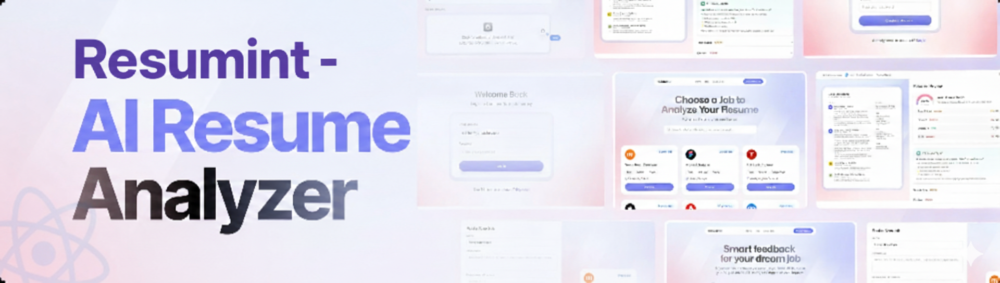

   
    
   
  

    
    
    
    
  

  <h1 align="center">Resumint</h1>

## 📖 Table of Contents

1. ✨ [Introduction](#introduction)
2. ⚙️ [Tech Stack](#tech-stack)
3. 🔋 [Features](#features)
4. 🧠 [System Architecture](#system-architecture)
5. 🔐 [Security & Privacy](#security--privacy)
6. ⚠️ [Limitations](#limitations)
7. 🚫 [Access & Usage](#access--usage)

---

## <a name="introduction">✨ Introduction</a>

Resumint is an AI-powered resume analysis web application built with React and Puter.js. It allows users to upload resumes, match them against job descriptions, and receive ATS-style scores along with structured feedback.

The project is designed as a **fully serverless, browser-first system** where authentication, file storage, and AI inference are handled directly via Puter’s platform — eliminating the need for a traditional backend.

This project focuses on:

- Practical AI integration in frontend systems  
- Real-world resume screening workflows  
- Clean UI/UX with reusable components  
- Privacy-first, user-owned data storage  

---

## <a name="tech-stack">⚙️ Tech Stack</a>

- **[React](https://react.dev/)** – Component-based UI library for building fast, scalable single-page applications.

- **[React Router v7](https://reactrouter.com/)** – Handles client-side routing with support for nested routes, loaders, and error boundaries.

- **[Puter.js](https://jsm.dev/resumind-puterjs)** – Client-side SDK providing authentication, file storage, database access, and AI APIs directly in the browser.

- **[Puter Platform](https://puter.com/)** – Used as a privacy-first cloud environment for user authentication and resume storage.

- **[Tailwind CSS](https://tailwindcss.com/)** – Utility-first CSS framework for building responsive, modern interfaces.

- **[TypeScript](https://www.typescriptlang.org/)** – Adds static typing for better maintainability and reliability.

- **[Vite](https://vite.dev/)** – Fast development server and build tool for modern frontend projects.

- **[Zustand](https://github.com/pmndrs/zustand)** – Lightweight global state management for predictable UI behavior.

---

## <a name="features">🔋 Features</a>

- **AI Resume Scoring (Claude Sonnet 3.7)** – Analyze resumes against job descriptions using Claude Sonnet 3.7 to generate ATS-style scores and structured, human-readable feedback.

- **Resume Upload & Cloud Storage** – Securely upload and manage multiple resumes using Puter’s personal cloud storage.

- **Serverless Authentication** – Browser-based login via Puter.js with no backend setup.

- **Job Matching Workflow** – Compare candidate resumes with job requirements in real time.

- **Reusable UI Components** – Modular React components for consistent layout and maintainability.

- **Responsive Design** – Optimized for desktop, tablet, and mobile devices.

- **State Management with Zustand** – Predictable and performant global state handling.

---

## <a name="system-architecture">🧠 System Architecture</a>

High-level flow:

User Browser
│
│── Authentication ──▶ Puter Auth Service
│
│── Resume Upload ───▶ Puter File Storage
│
│── Resume + Job Description
│
└── AI Request ──────▶ Puter AI API (LLM)
│
└── ATS Score + Feedback

yaml
Copy code

Key design choices:

- No traditional backend server  
- All API calls are made directly from the browser  
- User data is stored inside their own Puter account  
- AI inference is performed through Puter’s hosted models  
- Application state managed via Zustand  

This minimizes infrastructure complexity while maintaining scalability.

---

## <a name="security--privacy">🔐 Security & Privacy</a>

- Resumes are stored in the user’s personal Puter cloud storage.  
- The application does **not** maintain its own database of user resumes.  
- Authentication is handled by Puter using secure browser-based flows.  
- The project does not access user files without explicit permission.  
- All data ownership remains with the user.

Note: AI analysis is performed via third-party models provided by the Puter platform.

---

## <a name="limitations">⚠️ Limitations</a>

- AI scoring accuracy depends on the underlying language model and prompt quality.  
- Performance may vary based on browser memory and file size.  
- Currently optimized for English resumes.  
- Requires a Puter account for authentication and storage.  
- Not intended for enterprise-scale recruiting workflows.

---

## <a name="access--usage">🚫 Access & Usage</a>

This is a **personal portfolio project**.

- The source code repository is private.  
- Cloning and redistribution are not permitted.  
- This project is shared publicly for demonstration and evaluation purposes only.

---
